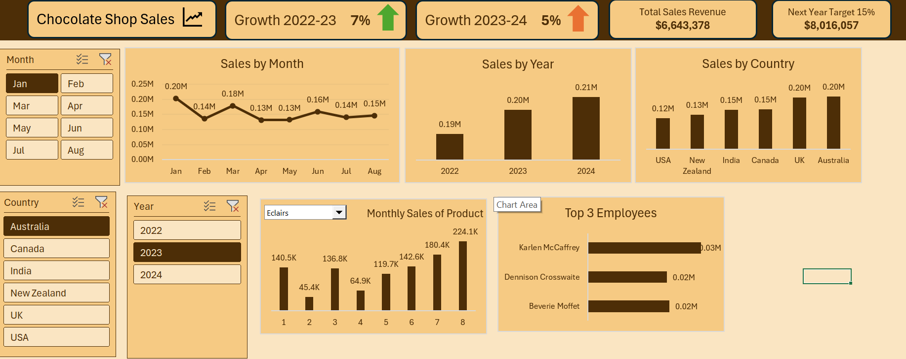

# 🍫 Chocolate Shop Sales Dashboard

## 📌 Project Overview
This project presents an interactive Chocolate Shop Sales Dashboard 
built in Microsoft Excel using Power Pivot and DAX Measures. 
The dashboard analyzes 3 years of global chocolate sales data 
(2022–2024) across 6 countries, 5 products, and top-performing 
employees, while providing year-over-year growth analysis and 
a 2025 sales target.

The objective was to transform raw transactional sales data into 
actionable business insights through interactive visualizations 
and KPI tracking.

----

## 🎯 Business Objectives
- Track and compare annual sales performance (2022, 2023, 2024)
- Analyze year-over-year revenue growth
- Identify top-performing countries and products
- Monitor employee sales performance
- Set a realistic 2025 sales target based on growth trends
- Enable dynamic filtering by Month, Year, and Country

----

## 📊 Dashboard Features

### KPI Cards
| Total Sales Revenue | $19,797,488 |
| Growth 2022-2023 | 7% ↑ |
| Growth 2023-2024 | 5% ↑ |
| Next Year Target (15%) | $8,016,057 |

### Interactive Filters
- Month Slicer (Jan – Aug)
- Year Slicer (2022, 2023, 2024)
- Country Slicer (Australia, Canada, India, New Zealand, UK, USA)
- Product Dropdown Filter

### Visualizations
- Sales by Month (Line Chart)
- Sales by Year (Column Chart)
- Sales by Country (Column Chart)
- Monthly Sales by Product (Column Chart with Dropdown)
- Top 3 Employees (Horizontal Bar Chart)

---

## 📈 Key Business Insights
- Total revenue reached **$19,797,488** across 3 years
- Sales grew **7%** from 2022 to 2023
- Growth continued at **5%** from 2023 to 2024
- **Australia** was the highest performing country at **$3.65M**
- **June** recorded the highest monthly sales at **$2.77M**
- All Top 3 Employees individually exceeded **$1M** in sales
- **2025 Target: $8,016,057** based on 15% growth from 2024

---

## 🛠 Tools & Techniques Used
- Microsoft Excel
- Power Pivot (Data Model)
- DAX Measures
- Power Query
- Pivot Tables & Pivot Charts
- Slicers & Dropdown Filters
- Conditional Formatting
- Dashboard Design

---

## 💡 DAX Measures Created
```DAX
Total Sales := SUM('Chocolate Sales (2)'[Amount])

Sales 2022 := CALCULATE([Total Sales], 
              YEAR('Chocolate Sales (2)'[Date]) = 2022)

Sales 2023 := CALCULATE([Total Sales], 
              YEAR('Chocolate Sales (2)'[Date]) = 2023)

Sales 2024 := CALCULATE([Total Sales], 
              YEAR('Chocolate Sales (2)'[Date]) = 2024)

Growth 2022-2023 := DIVIDE([Sales 2023] - [Sales 2022], [Sales 2022])

Growth 2023-2024 := DIVIDE([Sales 2024] - [Sales 2023], [Sales 2023])

Target 2025 := [Sales 2024] * 1.15
```

---

## 📂 Project Structure
chocolate-shop-sales-dashboard/

│

├── Chocolate_Shop.csv

├── Chocolate_Shop_Dashboard.xlsx

├── README.md

└── Screenshot.png

---

## 📸 Dashboard Preview


---

## 🚀 Skills Demonstrated
- Business Intelligence
- Data Analysis & Modeling
- DAX Measure Development
- Power Query Data Cleaning
- Dashboard Design
- Data Storytelling
- KPI Tracking & Reporting
- Time Intelligence Analysis

---

## 👨‍💻 Author
**Syed Sami Ullah**
Bachelor of Science in Computer Science
Aspiring Data Analyst | Business Intelligence Enthusiast

[](www.linkedin.com/in/syed-sami-ullah-9232602a6)
[]([your-github-url](https://github.com/SyedSamiUllah1))
